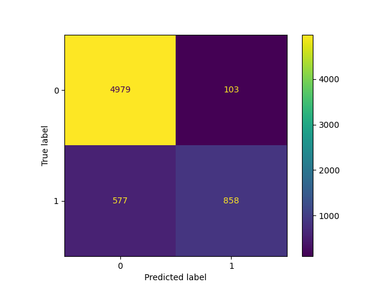
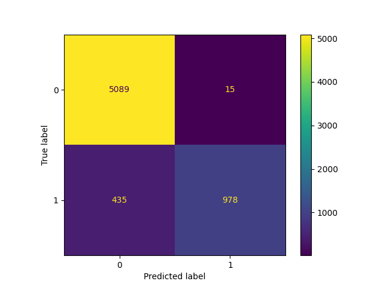

# Loan_Approval_Algorithm

## Description
The purpose of this project is to compare the effectiveness of several different types of machine learning models from the scikit-learn library. Each model is trained on the same credit risk dataset, 
after which their predictive accuracies are evaluated on the test data.

## Dataset
The models in this project are trained and tested using the dataset from https://www.kaggle.com/datasets/chilledwanker/loan-approval-prediction 

## Installation
To use this notebook, clone the repository and install the required libraries with

`pip install -r requirements.txt`

## Usage
To train and evaluate these models for yourself, just run the Scripy.ipynb notebook.

## Model Results
KNeighbors confusion matrix

Random Forest confusion matrix

Gradient Boosting confusion matrix
